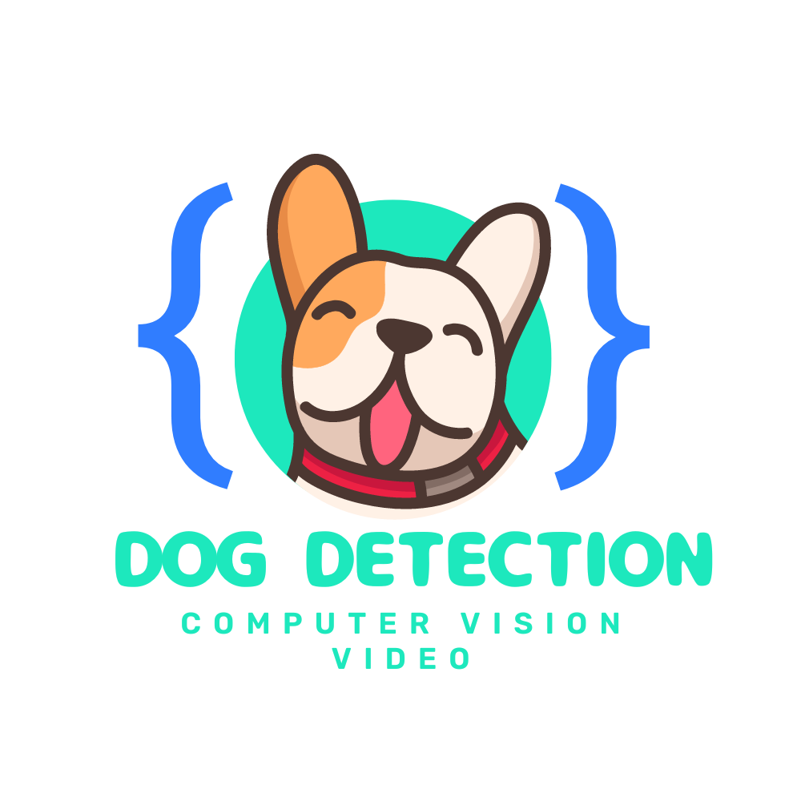

    

# jsDogDetect_server
Receive HTTP Posts from goPetCamera. Each post is a frame and will be processed with Tensorflow.js to detect dogs, cats, and people. Predictions will be processed and results uploaded to firebase

## How it works
Tensoflow JS Coco SSD model is used for prediction. Based on number of predictions over a sliding window a rolling average is calculated. Data can then be used in a D3.js plot for live activity metrics.
